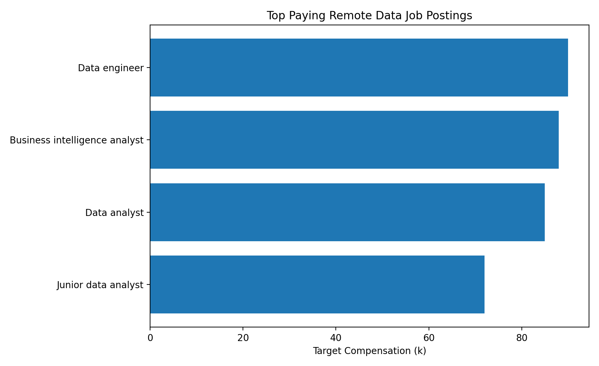

# Introduction

📊 Dive into the recruitment analytics market! Focusing on **remote Data roles**, this project explores:

- 💰 **Top-paying job postings**
- 🧠 **Skills required for top-paying roles**
- 📈 **Most in-demand skills**
- 🏆 **Top-paying skills**
- 🎯 **Optimal skills to learn** (High Demand + High Paying)

💡 SQL queries? Check them out here: **[project_sql folder](./project_sql/)**

# Background

As a recruitment agency, this project was created to better understand **which roles and skills lead to the strongest outcomes** in the job market.  
The goal is to identify **top-paying roles**, **most in-demand skills**, and the **optimal skills to learn** by combining both demand and compensation insights.

The dataset used in this project is **fictional but realistic**, and it is **based on real-world patterns and compensation ranges** from my own recruitment agency experience.  
It includes job postings, target compensation, work mode, and skill requirements linked through a bridge table.

## The questions I wanted to answer through my SQL queries were:

1. Which **remote Data job postings** offer the highest target compensation?
2. Which skills are required for these **top-paying remote Data roles**?
3. What are the most **in-demand skills** across all job postings 
4. Which skills are associated with **higher average target compensation**?
5. What are the most **optimal skills to learn** (High Demand AND High Paying)?


# Tools I Used

For this project, I used a combination of SQL and documentation tools to analyze recruitment data and present insights clearly:

- **SQL**: The core tool used to query and analyze the dataset (joins, CTEs, aggregations, ranking, filtering).
- **PostgreSQL / SQL Database**: Used to store the recruitment tables and execute queries efficiently.
- **Visual Studio Code (VS Code)**: Used to write and organize SQL scripts into a structured project folder.
- **Git & GitHub**: Used for version control and sharing this portfolio project online.
- **CSV Dataset**: Used as the data source for building the tables (fact, dimension, and bridge tables).
- **Data Visualization (Bar Chart)**: Used to visualize skill frequency across top-paying roles.
- **Microsoft Word**: Used to export a short portfolio-ready insights report.

## 1. Top Paying Remote Data Job Postings
To identify the highest-paying opportunities, I filtered the dataset to **remote roles** within the **Data job category** and ranked job postings by **TargetRate_k** (target compensation). This query highlights which remote Data jobs offer the strongest earning potential in this recruitment dataset.

```sql
SELECT DISTINCT
    job.jobid,
    job.jobdescription AS job_title,
    work_mode.workmode_name AS work_mode,
    job.targetrate_k AS target_compensation_k
FROM fact_recruitmentpipeline AS pipeline
INNER JOIN dim_job AS job
    ON pipeline.jobid = job.jobid
INNER JOIN dim_workmode AS work_mode
    ON pipeline.workmodeid = work_mode.workmodeid
WHERE job.jobcategory = 'Data'
  AND work_mode.is_remote = 'Yes'
ORDER BY job.targetrate_k DESC;

 ```

 ### Here’s the breakdown of the top-paying remote Data job postings:

- **Role Variety:** High-paying opportunities include both analytics and engineering-focused Data roles.
- **Remote Pay Potential:** Remote work does not limit earning potential—top remote roles still offer strong compensation.
- **Compensation Differences:** Target compensation varies across job titles, suggesting specialization can increase pay.



*Bar graph visualizing the target compensation for the top-paying remote Data job postings; ChatGPT generated this graph from my SQL query results.*


## 2. Skills Required for Top-Paying Remote Data Jobs

To identify the skills required for the highest-paying opportunities, I first selected the top-paying **remote roles** within the **Data job category** using TargetRate_k (target compensation). I then joined these jobs to the job-to-skill bridge table to retrieve the skills associated with each role. This query highlights which skills are most commonly required in top-paying remote Data job postings.


```sql
WITH remote_data_jobs AS (
    SELECT DISTINCT
        job.jobid,
        job.jobdescription AS job_title,
        work_mode.workmode_name AS work_mode,
        job.targetrate_k AS target_compensation_k
    FROM fact_recruitmentpipeline AS pipeline
    INNER JOIN dim_job AS job
        ON pipeline.jobid = job.jobid
    INNER JOIN dim_workmode AS work_mode
        ON pipeline.workmodeid = work_mode.workmodeid
    WHERE job.jobcategory = 'Data'
      AND work_mode.is_remote = 'Yes'
),
top_paying_jobs AS (
    SELECT *
    FROM remote_data_jobs
    ORDER BY target_compensation_k DESC
    LIMIT 3
)
SELECT
    top_jobs.jobid,
    top_jobs.job_title,
    top_jobs.work_mode,
    top_jobs.target_compensation_k,
    skill.skill_name
FROM top_paying_jobs AS top_jobs
INNER JOIN bridge_job_skill AS job_skill
    ON top_jobs.jobid = job_skill.jobid
INNER JOIN dim_skill AS skill
    ON job_skill.skillid = skill.skillid
ORDER BY
    top_jobs.target_compensation_k DESC,
    top_jobs.job_title,
    skill.skill_name;

 ```

### Here’s the breakdown of the skills required for top-paying remote Data jobs:

- **Core Technical Skills:** The highest-paying roles consistently require strong technical foundations (e.g., SQL, Python).
- **BI & Reporting Tools:** Visualization skills (e.g., Power BI) appear frequently, showing the importance of insight delivery.
- **Role-Specific Skills:** Some skills appear only in certain top roles, indicating specialization by job type.


| jobid | job_title                     | work_mode | target_compensation_k | skill_name      |
|------:|-------------------------------|----------:|----------------------:|-----------------|
| J011  | Data engineer                  | Remote    | 90                    | Data Modeling   |
| J011  | Data engineer                  | Remote    | 90                    | ETL             |
| J011  | Data engineer                  | Remote    | 90                    | Excel           |
| J011  | Data engineer                  | Remote    | 90                    | Python          |
| J011  | Data engineer                  | Remote    | 90                    | SQL             |
| J010  | Business intelligence analyst  | Remote    | 88                    | Excel           |
| J010  | Business intelligence analyst  | Remote    | 88                    | Power BI        |
| J010  | Business intelligence analyst  | Remote    | 88                    | Python          |
| J010  | Business intelligence analyst  | Remote    | 88                    | Reporting       |
| J010  | Business intelligence analyst  | Remote    | 88                    | SQL             |
| J009  | Data analyst                   | Remote    | 85                    | Data Modeling   |
| J009  | Data analyst                   | Remote    | 85                    | DAX             |
| J009  | Data analyst                   | Remote    | 85                    | Excel           |
| J009  | Data analyst                   | Remote    | 85                    | Power BI        |
| J009  | Data analyst                   | Remote    | 85                    | Python          |

*Table summarizing the skills linked to the top-paying remote Data job postings (Top 3 by TargetRate_k).*

## 3. Most In-Demand Skills (All Job Placements)

To identify the most in-demand skills, I analyzed all job placements in the dataset and counted how often each skill appears across roles. By joining job placements to the job-to-skill bridge table, this query highlights which skills employers request most frequently overall in this recruitment dataset.


```sql
SELECT
    skill.skill_name,
    COUNT(*) AS demand_count
FROM fact_recruitmentpipeline AS pipeline
INNER JOIN dim_job AS job
    ON pipeline.jobid = job.jobid
INNER JOIN dim_workmode AS work_mode
    ON pipeline.workmodeid = work_mode.workmodeid
INNER JOIN bridge_job_skill AS job_skill
    ON pipeline.jobid = job_skill.jobid
INNER JOIN dim_skill AS skill
    ON job_skill.skillid = skill.skillid
WHERE job.jobcategory = 'Data'
  AND work_mode.is_remote = 'Yes'
GROUP BY skill.skill_name
ORDER BY demand_count DESC;

 ```

 ### Here’s the breakdown of the most in-demand skills across job postings in the dataset:

- **Baseline Skills Matter:** High-frequency skills like Excel appear across many roles, making them strong foundational requirements in this dataset.
- **Technical Breadth Shows Up:** Python, Linux, and Networking show consistent demand, reflecting the importance of technical versatility across job postings.
- **Hiring Priorities by Frequency:** Skills with higher counts represent what employers request most often across the full set of roles in the dataset.

| skill_name          | demand_count |
|--------------------|-------------:|
| Excel              |            8 |
| Python             |            5 |
| Linux              |            5 |
| Networking         |            4 |
| Quality Assurance  |            4 |

*Table summarizing the most in-demand skills across job postings in the dataset (Ranked by frequency).*


## 4. Top-Paying Skills (All Job Placements)

To identify the top-paying skills, I calculated the average **TargetRate_k** (target compensation) for each skill across all job placements in the dataset. By joining job placements to the job-to-skill bridge table, this query highlights which skills are associated with higher average compensation overall in this recruitment dataset.

```sql
SELECT
    skill.skill_name,
    ROUND(AVG(job.targetrate_k), 2) AS avg_target_compensation_k
FROM fact_recruitmentpipeline AS pipeline
INNER JOIN dim_job AS job
    ON pipeline.jobid = job.jobid
INNER JOIN bridge_job_skill AS job_skill
    ON pipeline.jobid = job_skill.jobid
INNER JOIN dim_skill AS skill
    ON job_skill.skillid = skill.skillid
GROUP BY skill.skill_name
ORDER BY avg_target_compensation_k DESC;

 ```

 ### Here’s the breakdown of the top-paying skills across all job placements:

- **Cloud + Data Engineering Skills Lead Pay:** Skills like Cloud Data Platforms, Data Modeling, and ETL are strongly associated with higher average target compensation.
- **Technical + Collaboration Skills Matter:** Python and Git show that employers value both strong technical execution and the ability to work in modern development workflows.
- **Infrastructure Knowledge Adds Value:** Linux and Networking appear among the highest-paying skills, highlighting the importance of system-level understanding in higher-compensated roles.

| skill_name               | avg_target_compensation_k |
|-------------------------|--------------------------:|
| Cloud Data Platforms     |                     88.00 |
| Customer Communication   |                     88.00 |
| Data Modeling            |                     87.37 |
| Python                   |                     86.72 |
| Git                      |                     83.65 |
| Monitoring               |                     83.24 |
| Networking               |                     83.12 |
| Linux                    |                     82.05 |
| Power BI                 |                     81.64 |
| ETL                      |

*Table summarizing the top-paying skills across all job placements in the dataset (Ranked by average TargetRate_k).*

## 5. Optimal Skills to Learn (High Demand + High Paying)

To identify the most optimal skills to learn, I combined both **demand** and **compensation** insights by calculating (1) how often each skill appears across all job placements and (2) the average **TargetRate_k** associated with jobs requiring that skill. This query highlights skills that are both **high demand** and **high paying**, making them the most strategic skills to prioritize.

```sql
SELECT
    skill.skillid AS skill_id,
    skill.skill_name AS skills,
    COUNT(*) AS demand_count,
    ROUND(AVG(job.targetrate_k), 2) AS avg_salary
FROM fact_recruitmentpipeline AS pipeline
INNER JOIN dim_job AS job
    ON pipeline.jobid = job.jobid
INNER JOIN bridge_job_skill AS job_skill
    ON pipeline.jobid = job_skill.jobid
INNER JOIN dim_skill AS skill
    ON job_skill.skillid = skill.skillid
GROUP BY skill.skillid, skill.skill_name
ORDER BY
    demand_count DESC,
    avg_salary DESC;

 ```

### Here’s the breakdown of the top-paying skills across all job placements:

- **Cloud + Data Engineering Skills Lead Pay:** Skills like Cloud Data Platforms, Data Modeling, and ETL are strongly associated with higher average target compensation.
- **Technical + Collaboration Skills Matter:** Python and Git show that employers value both strong technical execution and the ability to work in modern development workflows.
- **Infrastructure Knowledge Adds Value:** Linux and Networking appear among the highest-paying skills, highlighting the importance of system-level understanding in higher-compensated roles.

| skill_name               | avg_target_compensation_k |
|-------------------------|--------------------------:|
| Cloud Data Platforms     |                     88.00 |
| Customer Communication   |                     88.00 |
| Data Modeling            |                     87.37 |
| Python                   |                     86.72 |
| Git                      |                     83.65 |
| Monitoring               |                     83.24 |
| Networking               |                     83.12 |
| Linux                    |                     82.05 |
| Power BI                 |                     81.64 |
| ETL                      |                     80.96 |

*Table summarizing the top-paying skills across all job placements in the dataset (Ranked by average TargetRate_k).*

## What I Learned

Throughout this project, I strengthened my recruitment analytics toolkit and sharpened my SQL skills:

- **🧩 Market-Ready Query Crafting:** Built end-to-end SQL queries with joins, CTEs, filtering, and ranking to answer real recruitment questions around roles, pay, and skill requirements.
- **📊 Demand vs. Compensation Analysis:** Measured skill demand using frequency counts and linked it to average target compensation to uncover which skills are both common and valuable.
- **🎯 Actionable Skill Prioritization:** Turned raw placement + skill data into a clear learning roadmap by identifying “optimal skills” (High Demand + High Paying) that maximize career ROI

## Conclusions

### Insights

1. **Top-Paying Remote Data Jobs:** The highest-paying remote Data roles in this dataset include a mix of analytics and engineering-focused positions, showing that remote work can still offer strong compensation.
2. **Skills for Top-Paying Roles:** Top-paying remote Data jobs consistently require strong technical foundations such as SQL and Python, along with BI and reporting tools like Power BI.
3. **Most In-Demand Skills:** Across all job placements, skills like Excel, Python, Linux, and Networking appear most frequently, making them valuable baseline skills in the dataset.
4. **Top-Paying Skills:** Skills related to cloud platforms, data modeling, and programming (e.g., Python, Git) are associated with higher average target compensation, suggesting specialization increases earning potential.
5. **Optimal Skills to Learn:** Python stands out as one of the best skills to learn, combining both high demand and high average compensation, making it a strong “high ROI” skill in this recruitment dataset.

### Closing Thoughts

This project strengthened my SQL skills and gave me practical insight into how job placements connect **skills**, **demand**, and **compensation** in the recruitment market. By analyzing which skills are most requested and which skills are linked to higher target pay, I was able to identify a clear set of “high ROI” skills to prioritize. Overall, this analysis reinforced the value

